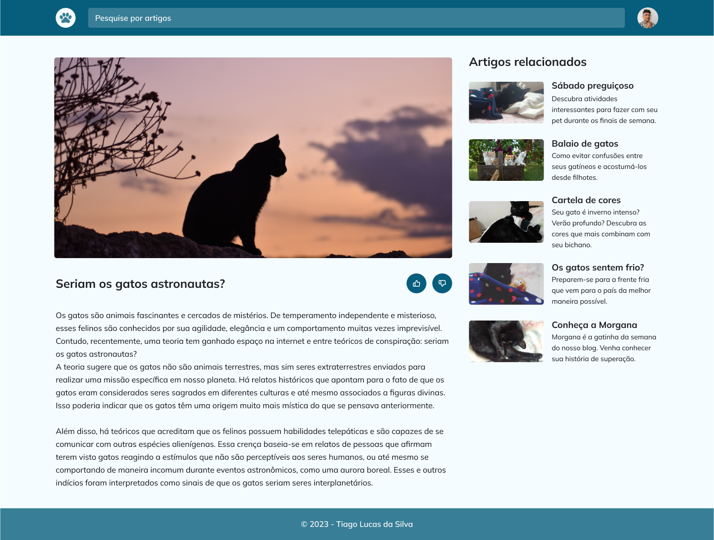

## 💻 Projeto

# Blog de Gatos
Este projeto consiste em desenvolver um site responsivo de blog com artigos sobre gatos. O projeto também apresenta uma barra de busca, recomendação de artigos relacionados e avaliação do artigo. Algumas fotos dos gatos utilizam uma API para que as fotos sempre sejam diferentes. O blog apresenta diversos recursos para oferecer uma experiência agradável aos leitores.

 

  
  

  ## 📝 Licença

Esse projeto está sob a licença MIT. Veja o arquivo [LICENSE](LICENSE) para mais detalhes.
